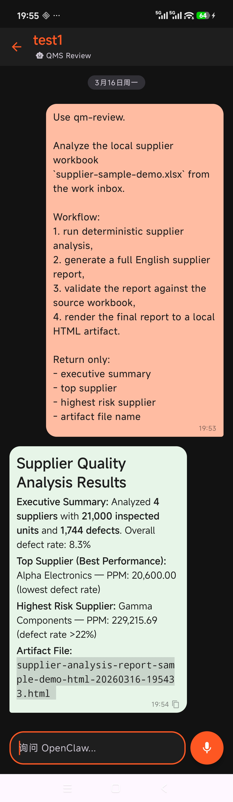
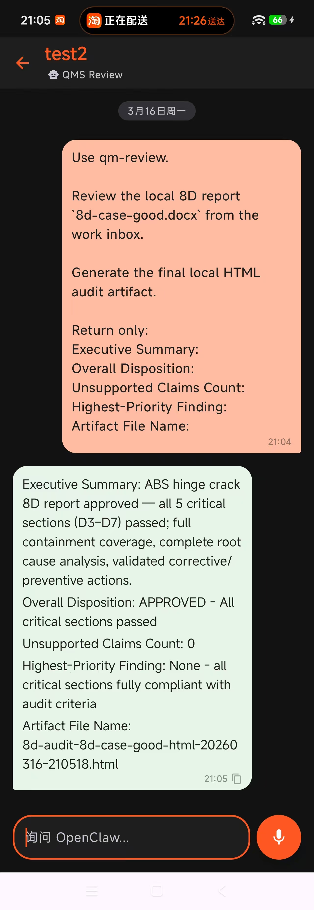
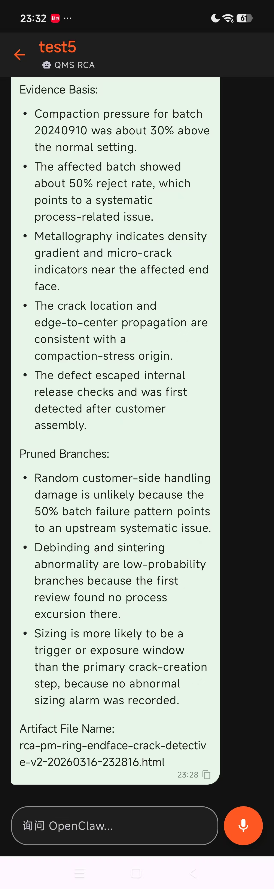
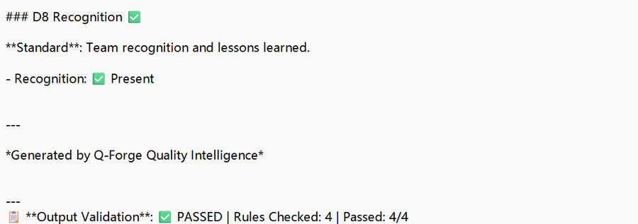
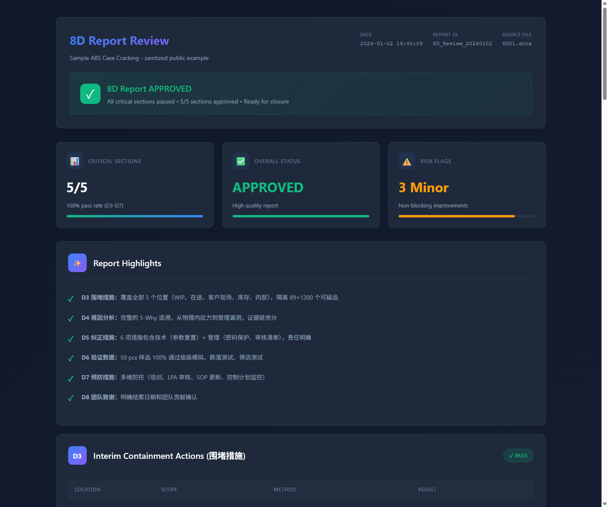
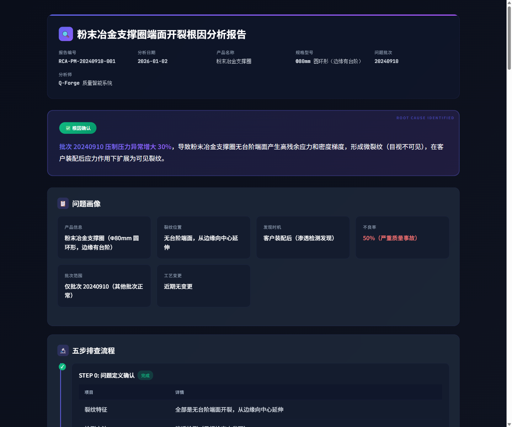
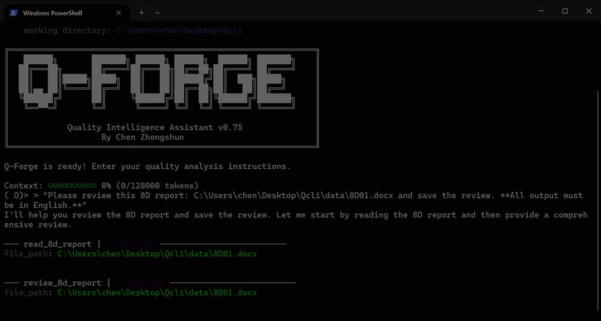

# Q-Forge

Q-Forge is a quality-focused agent system for manufacturing workflows, not a generic chatbot.

This public repository now serves two jobs:

- public proof that the quality workflows really run
- public blueprint for a clean-host, no-core-patch OpenClaw QMS overlay

> In roughly 24 hours, Q-Forge moved from an already-proven Goose + MCP setup into a local OpenClaw quality edition with Android mobile proof. By March 19, 2026, that migration was hardened into a validated dual-agent baseline on a clean OpenClaw host.

## Current Validated Baseline

The current private working baseline behind this public repo is:

- clean OpenClaw host kept close to upstream
- no OpenClaw core modifications required for QMS V1
- local LM Studio backend
- `secretary` as the front door and `qms` as the specialist
- skillized QMS protocol instead of free-form prompting
- deterministic runners for `8D`, `RCA`, `Supplier`, and `Reporter`
- live regression on real sessions
- real `secretary -> qms` handoff validation

This matters because the project is no longer only proving that a model can answer quality questions. It is proving that a local quality runtime can stay reviewable, testable, and upgrade-safe.

## Proof At A Glance

<table>
  <tr>
    <td align="center" width="33%">
      
    </td>
    <td align="center" width="33%">
      
    </td>
    <td align="center" width="33%">
      
    </td>
  </tr>
  <tr>
    <td align="center">Supplier mobile proof</td>
    <td align="center">8D mobile proof</td>
    <td align="center">RCA mobile proof</td>
  </tr>
  <tr>
    <td align="center" width="33%">
      
    </td>
    <td align="center" width="33%">
      
    </td>
    <td align="center" width="33%">
      
    </td>
  </tr>
  <tr>
    <td align="center">Validation lock</td>
    <td align="center">8D report artifact</td>
    <td align="center">RCA report artifact</td>
  </tr>
</table>

Open the preview image to watch the 40-second 8D demo from the earlier Goose + MCP proof phase.

## Already Working Now

| Capability | Current working path | Public proof |
| --- | --- | --- |
| **8D** | strict 8D audit path, deterministic D3-D7 checks, local HTML artifact, live regression, Android-triggered proof | [good 8D HTML](docs/mobile-proof/8d-mobile-proof-good-20260316.html), [bad 8D HTML](docs/mobile-proof/8d-mobile-proof-bad-20260316.html), [good chat screenshot](docs/mobile-proof/8d-mobile-chat-proof-good-20260316.jpg), [bad chat screenshot](docs/mobile-proof/8d-mobile-chat-proof-bad-20260316.jpg) |
| **RCA** | detective-style branch-pruning chat, evidence-chain discipline, local HTML artifact, live regression, Android-triggered proof | [RCA HTML](docs/mobile-proof/rca-mobile-proof-20260316.html), [start screenshot](docs/mobile-proof/rca-mobile-chat-start-20260316.jpg), [pruning screenshot](docs/mobile-proof/rca-mobile-chat-pruning-20260316.jpg), [conclusion screenshot](docs/mobile-proof/rca-mobile-chat-conclusion-20260316.jpg) |
| **Supplier** | deterministic spreadsheet analysis, validation lock, local HTML artifact, live regression, Android-triggered proof | [supplier HTML](docs/mobile-proof/supplier-mobile-proof-20260316.html), [supplier screenshot](docs/mobile-proof/supplier-mobile-proof-20260316.jpg) |
| **Reporter** | deterministic markdown-to-HTML renderer used by all three flows above | [8D preview](assets/8d-rendered-report-preview.png), [RCA preview](assets/rootcause-rendered-report-preview.png) |
| **Secretary -> QMS** | front-door intake, specialist handoff, artifact-aware return path | [overlay baseline note](docs/openclaw-v1-overlay-baseline.md) |

## Why This Is More Than "Just Generate A Skill"

Simple skills can be generated quickly. A reliable manufacturing workflow cannot stop there.

This project is building a stricter pattern:

- role boundaries instead of one giant assistant
- deterministic runners instead of model-only claims
- artifacts and audit traces instead of disappearing chat output
- regression checks instead of trusting one lucky run
- a clean OpenClaw host plus overlay so upgrades stay manageable

Today's deterministic scaffolding becomes tomorrow's reusable machine capability. The goal is not to wait for magic. The goal is to turn tested quality logic into stable building blocks.

## Why Not Generic OpenClaw + Skills

Generic OpenClaw plus skills can add knowledge, but it does not automatically solve the runtime problem of quality work.

Quality-specific deployment needs:

- local data handling instead of casual cloud routing
- deterministic tool boundaries
- artifacts that can be reviewed later
- regression that can be rerun after host upgrades
- role separation between coordination and deep quality work

That is why this project is shaped as an overlay, not only a prompt pack.

## What Is Public Here

- public skill packages under [`skills/`](skills/)
- sanitized inputs, outputs, and rendered artifacts under [`examples/`](examples/) and [`docs/mobile-proof/`](docs/mobile-proof/)
- public design and migration documents under [`docs/`](docs/)
- a minimal framework snapshot under [`framework/`](framework/) so other builders can follow the architecture without needing the full private runtime

## Follow The Build

### Public design docs

- [OpenClaw V1 Overlay Baseline](docs/openclaw-v1-overlay-baseline.md)
- [Public Skill Open Tiers](docs/public-skill-open-tiers.md)
- [OpenClaw Quality Edition](docs/openclaw-quality-edition.md)
- [24-Hour OpenClaw Migration](docs/openclaw-migration-24h.md)
- [OpenClaw Quality Architecture](docs/openclaw-quality-architecture.md)
- [Android Secure Chat Client](docs/android-secure-chat-client.md)
- [Mobile Proof Index](docs/mobile-proof/README.md)
- [Project Roadmap](docs/openclaw-quality-roadmap.md)

### Public framework snapshot

- [framework/README.md](framework/README.md)
- [OpenClaw quality profile example](framework/openclaw-quality-edition/openclaw.qms.local.example.jsonc)
- [Tool contract snapshot](framework/openclaw-quality-edition/tool-contracts.snapshot.ts)
- [Bridge reference snapshot](framework/openclaw-quality-edition/qms_bridge_reference.py)
- [qm-review workspace rules](framework/openclaw-quality-edition/qm-review.AGENTS.md)
- [qm-rca workspace rules](framework/openclaw-quality-edition/qm-rca.AGENTS.md)
- [Logic path summary](framework/openclaw-quality-edition/logic-paths.md)
- [RCA detective flow](framework/openclaw-quality-edition/rca_detective_flow.md)
- [Mobile runtime boundary](framework/openclaw-quality-edition/mobile_runtime_boundary.md)

## Earlier Public Examples

These remain useful as the original Goose + MCP proof layer:

- [8D good input](examples/8d/input/8d-case-good.docx)
- [8D bad input](examples/8d/input/8d-case-bad.docx)
- [8D audit markdown](examples/8d/output/8d-review-approved.md)
- [8D rendered HTML](examples/8d/output/8d-review-rendered.html)
- [RCA legacy markdown](examples/rootcause/output/rootcause-pm-ring.md)
- [RCA legacy rendered HTML](examples/rootcause/output/rootcause-pm-ring.html)

## Repository Layout

- `skills/`: public skill packages
- `examples/`: sanitized source examples from the public proof layer
- `assets/`: demo media and report previews
- `docs/`: public migration, architecture, and validated-baseline documents
- `framework/`: minimal public code and config skeleton for the quality runtime

## Scope Note

- Included here:
  - proof artifacts
  - migration explanation
  - validated-baseline explanation
  - framework skeleton
  - public skill packages
- Intentionally excluded:
  - private project memory
  - private runtime configs and secrets
  - full local fork implementation
  - real customer data
  - full Android private implementation details

## Contact

- X: [@QForge_Builder](https://x.com/QForge_Builder)
- Email: [zhongshunchen2004@gmail.com](mailto:zhongshunchen2004@gmail.com)

## License

Apache License 2.0. See [LICENSE](LICENSE).
