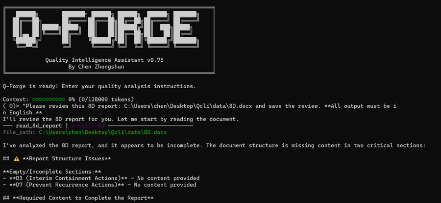
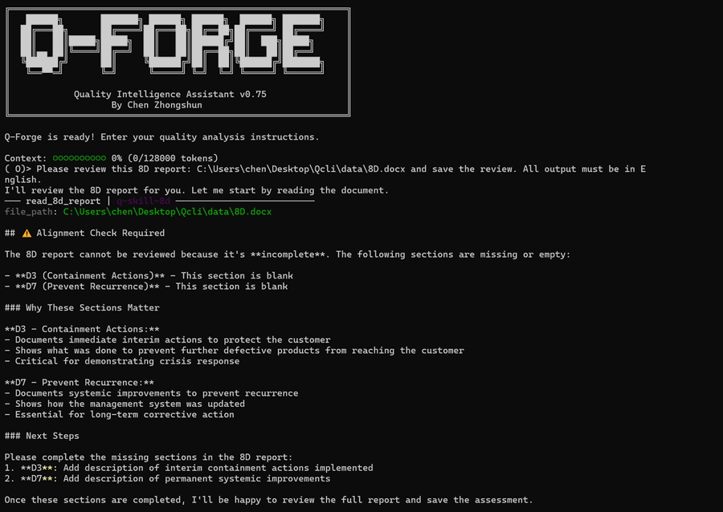

# Q-Forge

Q-Forge is a quality-focused agent system for manufacturing workflows, not a general chatbot.

This public repository is the proof layer: real skill packages, sanitized examples, rendered outputs, and a short demo. The customized Goose or Q-Forge runtime stays local.

[](assets/8d-docx-review-demo-short.mp4)

Open the preview image to watch the 40-second 8D demo.

<p align="center">
  
  
  
</p>

## Already Working Now

| Capability | What is already working | Public proof |
| --- | --- | --- |
| **8D** | Word-based 8D intake, deterministic D3-D7 checks, audit verdict, and closure guidance | [good input](examples/8d/input/8d-case-good.docx), [bad input](examples/8d/input/8d-case-bad.docx), [approved audit](examples/8d/output/8d-review-approved.md), [rendered HTML](examples/8d/output/8d-review-rendered.html) |
| **RCA** | Constrained branch-pruning root cause reasoning with saved case output | [markdown output](examples/rootcause/output/rootcause-pm-ring.md), [rendered HTML](examples/rootcause/output/rootcause-pm-ring.html) |
| **Reporter** | Markdown and logical outputs rendered into decision-ready HTML pages | [8D preview](assets/8d-rendered-report-preview.png), [RCA preview](assets/rootcause-rendered-report-preview.png) |
| **Supplier** | Working package for IQC and supplier quality monitoring | Capability summary only in this pass: [q-skill-supplier](skills/q-skill-supplier/README.md) |

<p align="center">
  
  
</p>

## Public Examples

- 8D good input: [examples/8d/input/8d-case-good.docx](examples/8d/input/8d-case-good.docx)
- 8D bad input: [examples/8d/input/8d-case-bad.docx](examples/8d/input/8d-case-bad.docx)
- 8D approved markdown output: [examples/8d/output/8d-review-approved.md](examples/8d/output/8d-review-approved.md)
- 8D rendered HTML output: [examples/8d/output/8d-review-rendered.html](examples/8d/output/8d-review-rendered.html)
- RCA markdown output: [examples/rootcause/output/rootcause-pm-ring.md](examples/rootcause/output/rootcause-pm-ring.md)
- RCA rendered HTML output: [examples/rootcause/output/rootcause-pm-ring.html](examples/rootcause/output/rootcause-pm-ring.html)

Note: the HTML files are checked in as final rendered outputs. GitHub will show the file source in-browser; download or open them locally if you want the full page experience.

## Why This Is Real

- The [Jan 18, 2026 output guardrails thread](https://x.com/QForge_Builder/status/2012897010924335241) shows the validation layer that now sits behind the public 8D example.
- The [8D DOCX review demo](https://x.com/QForge_Builder/status/2002694747144741127) matches the same working flow shown in this repository.
- The examples here come from saved local runs and archived reports, then lightly sanitized for public review. They are not hand-written demo prose.

## Builder Update

- Since the first Q-Forge build, I have continued applying it in real local experiments. The result has been clear enough to validate the core thesis: large models plus deterministic rules can produce useful quality outcomes.
- Since February 2026, I have also been experimenting with OpenClaw. I have enjoyed building with it, and it feels closer to the runtime direction I want to keep exploring.
- The original implementation path here was Goose plus MCP. The direction I am now exploring is a quality-customized OpenClaw runtime plus Q-Forge-style skills.
- Q-Forge remains the public proof layer for what has already worked. The runtime path may evolve, but the practical value of the skills-plus-rules approach has already been validated.

## Maintainer Note

This repository contains commits from two personal environments operated by the same builder during local experimentation and migration work.

## Repository Layout

- `skills/`: the public skill packages
- `examples/`: sanitized inputs, outputs, and rendered pages used for this pass
- `assets/`: screenshots and short demo media for fast review
- `docs/`: brief public docs for the current Hackathon pass

## Quick Start

```bash
git clone https://github.com/Qforge-chen/Q-forge.git
cd Q-forge

cd skills/q-skill-8d
pip install -e .
```

You can install the other packages the same way:

- `skills/q-skill-rootcause`
- `skills/q-skill-reporter`
- `skills/q-skill-supplier`

## Scope Note

- Included here: skill packages, public examples, screenshots, and demo assets.
- Intentionally excluded: private project memory, internal operating documents, and the customized local Goose or Q-Forge runtime.

## Contact

- X: [@QForge_Builder](https://x.com/QForge_Builder)
- Email: [zhongshunchen1982@gmail.com](mailto:zhongshunchen1982@gmail.com)

## License

Apache License 2.0. See [LICENSE](LICENSE).
