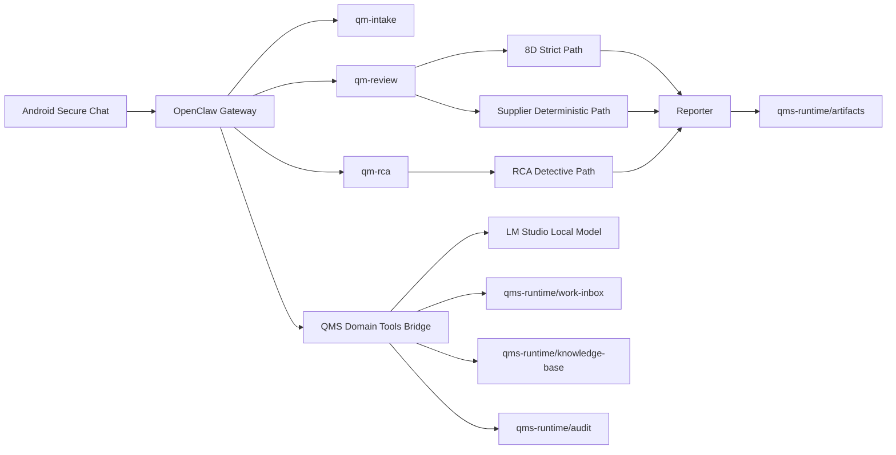

# OpenClaw Quality Architecture

## Reading the diagram

- the phone is only a secure chat terminal
- the gateway handles pairing, TLS, sessions, and routing
- business logic is not inside the phone
- business logic is also not left to free-form model output
- quality logic lives in deterministic QMS tool paths

## Main agent roles

### `qm-intake`

- classify task type
- route to the right quality path
- keep the front door narrow

### `qm-review`

- strict 8D auditing
- supplier spreadsheet analysis
- local artifact generation for review-style tasks

### `qm-rca`

- detective-style RCA
- branch pruning
- strongest cause-path convergence
- final conclusion report only after the conversation has stabilized

## Data boundary

Two local data layers are kept separate:

### Stable knowledge layer

- standards
- SOPs
- templates
- retained reference material

### Daily work layer

- incoming 8D reports
- RCA raw case notes
- supplier spreadsheets
- active work items

## Artifact philosophy

The phone does not need to hold the whole working memory of the case. The phone triggers the workflow. The rendered report becomes the stable artifact.
